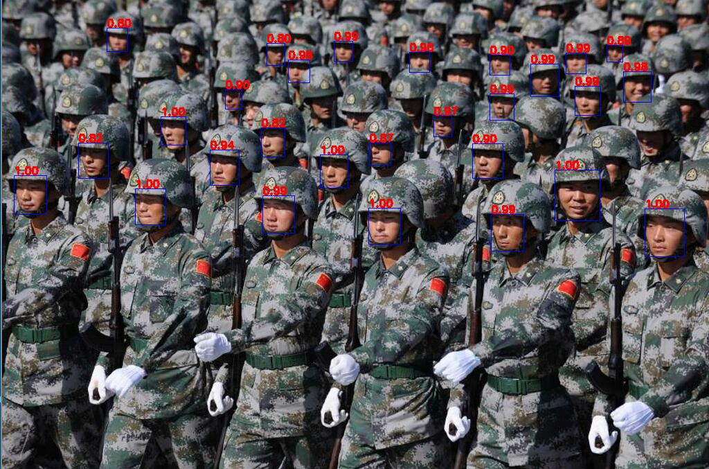

使用Pytorch构建Mtcnn人脸检测网络，训练完成后发现针对大场景和侧脸识别效果不佳。
可能是因为训练迭代数不够，毕竟由于时间问题我只训练了一轮迭代。
## LOSS
PNet Loss
```
batch_idx:6730, cls_loss:0.1414, reg_loss0.0097, loss:0.1462, accuracy:0.9289, precision:0.8514, recall:0.9265
batch_idx:6731, cls_loss:0.1324, reg_loss0.0085, loss:0.1366, accuracy:0.9690, precision:0.9722, recall:0.9333
batch_idx:6732, cls_loss:0.2199, reg_loss0.0092, loss:0.2245, accuracy:0.9174, precision:0.9091, recall:0.8333
batch_idx:6733, cls_loss:0.2316, reg_loss0.0088, loss:0.2360, accuracy:0.8964, precision:0.8400, recall:0.8514
batch_idx:6734, cls_loss:0.2025, reg_loss0.0086, loss:0.2068, accuracy:0.9276, precision:0.9136, recall:0.8916
batch_idx:6735, cls_loss:0.1573, reg_loss0.0085, loss:0.1616, accuracy:0.9484, precision:0.9552, recall:0.8889
batch_idx:6736, cls_loss:0.1850, reg_loss0.0124, loss:0.1912, accuracy:0.9333, precision:0.9231, recall:0.9231
train pnet complete
```
RNet Loss
```
batch_idx:1815, cls_loss:0.1072, reg_loss0.0063, loss:0.1103, accuracy:0.9647, precision:0.9688, recall:0.8267
batch_idx:1816, cls_loss:0.1138, reg_loss0.0074, loss:0.1175, accuracy:0.9597, precision:0.9077, recall:0.8429
batch_idx:1817, cls_loss:0.0964, reg_loss0.0073, loss:0.1000, accuracy:0.9676, precision:0.9571, recall:0.8590
batch_idx:1818, cls_loss:0.1355, reg_loss0.0063, loss:0.1387, accuracy:0.9507, precision:0.9385, recall:0.7821
batch_idx:1819, cls_loss:0.1060, reg_loss0.0074, loss:0.1096, accuracy:0.9591, precision:1.0000, recall:0.7600
batch_idx:1820, cls_loss:0.1117, reg_loss0.0077, loss:0.1156, accuracy:0.9667, precision:0.9565, recall:0.8462
train rnet complete
```
ONet Loss
```
batch_idx:527, cls_loss:0.1109, reg_loss0.0034, loss:0.1142, accuracy:0.9740, precision:0.9777, recall:0.9722
batch_idx:528, cls_loss:0.1279, reg_loss0.0036, loss:0.1315, accuracy:0.9673, precision:1.0000, recall:0.9371
batch_idx:529, cls_loss:0.1059, reg_loss0.0037, loss:0.1096, accuracy:0.9521, precision:0.9716, recall:0.9344
batch_idx:530, cls_loss:0.0860, reg_loss0.0038, loss:0.0897, accuracy:0.9657, precision:0.9854, recall:0.9575
batch_idx:531, cls_loss:0.1125, reg_loss0.0038, loss:0.1163, accuracy:0.9540, precision:0.9416, recall:0.9773
train onet complete
```
## Result


